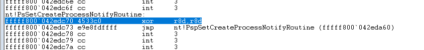
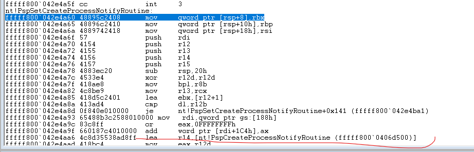

## 汇编代码

##获取CreateProcessNotify回调函数的结果

PsSetCreateProcessNotifyRoutine函数就是 jmp 执行PspSetCreateProcessNotifyRoutine这个函数

然后PspSetCreateProcessNotifyRoutine 负责将注册的地址放到数组中 
图片中 lea r14 xxx  xxx为数组的地址 
代码的大概逻辑就是  
    1.先找到PsSetCreateProcessNotifyRoutine函数的地址 
    2.再找到PspSetCreateProcessNotifyRoutine
    3.遍历数组 拿到回调地址 并 & 标记 进行输出 